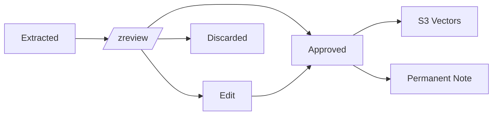

# /zreview - Review Extracted Knowledge

Review and curate recently extracted knowledge. Approve, edit, or discard items before they're considered permanent.

## Usage

```text
/zreview              # Review unreviewed items
/zreview --today      # Review today's extractions
/zreview --all        # Review all pending items
```

## Implementation

When this skill is invoked:

1. **Fetch unreviewed items** from Obsidian:

```bash
# Find extraction files
mcp__obsidian__search_notes \
  --query "reviewed: false" \
  --searchFrontmatter true \
  --limit 20
```

1. **Display items for review**:

```text
📋 Knowledge Review Queue (5 items)

━━━━━━━━━━━━━━━━━━━━━━━━━━━━━━━━━━━━━━
1. [fact] S3 Vectors Embedding Dimensions
   "Bedrock Titan uses 1536 dimensions, not 1024"
   Tags: aws, s3-vectors, bedrock
   Source: Session 2026-01-27

   [a]pprove  [e]dit  [d]iscard  [s]kip
━━━━━━━━━━━━━━━━━━━━━━━━━━━━━━━━━━━━━━
```

1. **For each item**, allow user to:
   - **Approve**: Mark as reviewed, optionally promote to permanent note
   - **Edit**: Modify content, tags, or type before approving
   - **Discard**: Delete the extraction
   - **Skip**: Leave for later review

1. **Update Obsidian** with review status:

```bash
mcp__obsidian__update_frontmatter \
  --path "knowledge-base/extractions/..." \
  --frontmatter '{"reviewed": true, "reviewed_date": "2026-01-27"}'
```

1. **Optionally sync to S3 Vectors** for approved items:
   - Generate embedding
   - Store in S3 Vectors with metadata
   - Update local record with vector ID

## Review Workflow



## Notes

- Extractions older than 7 days without review are auto-flagged
- High-confidence extractions (>0.9) can be auto-approved via config
- Discarded items are moved to `knowledge-base/extractions/.archive/`
