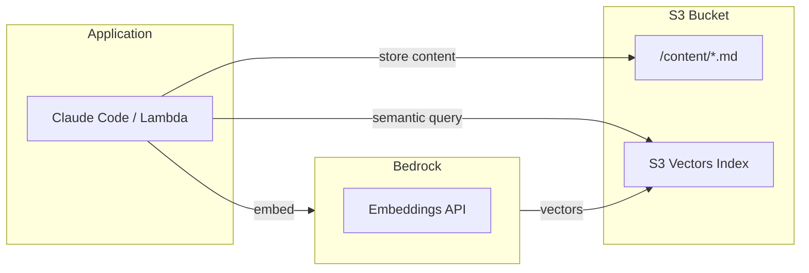

# AWS S3 Vectors for Semantic Search

## Problem

When building AI applications requiring semantic search (RAG, knowledge bases, memory systems), developers often default to:
- **Aurora + pgvector**: Works but ~$10-20/month minimum, cold start issues
- **OpenSearch Serverless**: Powerful but ~$175/month minimum
- **Pinecone/external**: External dependency, ongoing costs

S3 Vectors (GA December 2025) is often the better choice but less known.

## Context / Trigger Conditions

Use S3 Vectors when:
- Building semantic search for personal/small-scale use
- Need vector storage for <2 billion vectors
- Want serverless with no infrastructure management
- Cost sensitivity (~$2-5/month vs $10-175/month alternatives)
- Don't need complex SQL JOINs across vectors
- Building AI memory, Zettelkasten, or knowledge management systems

## Solution

### Key Facts

| Feature | Value |
|---------|-------|
| GA Date | December 2025 |
| Max vectors/index | 2 billion |
| Max vectors/bucket | 20 trillion |
| Metadata keys | 50 per vector |
| Latency (frequent) | ~100ms |
| Latency (cold) | <1 second |
| Cost reduction | ~90% vs specialized vector DBs |

### Architecture Pattern



### Schema Design

```python
# Vector with metadata (up to 50 keys)
{
    "id": "note-123",
    "embedding": [...],  # 1536 floats for Titan, 1024 for multilingual-e5-large
    "metadata": {
        "title": "My Note Title",
        "type": "permanent-note",
        "topic": "machine-learning",
        "tags": "embeddings,search",  # comma-separated string
        "relevance": 8,
        "parent_id": "note-100",
        "created_at": "2026-01-27",
        "s3_key": "content/note-123.md"
    }
}
```

### Cost Estimate (Personal Use)

| Component | Usage | Monthly |
|-----------|-------|---------|
| PUT (upload) | 10MB | $0.05 |
| Storage | 100MB | $0.02 |
| Queries | 3,000 | $1.50 |
| S3 (content) | 1GB | $0.02 |
| Bedrock embeddings | 1,000 | $0.10 |
| **Total** | | **$2-5** |

### When to Add Aurora Instead

S3 Vectors lacks relational queries. Add Aurora if you need:
- Complex SQL JOINs across relationships
- Multi-hop graph traversal (A → B → C)
- Aggregations across metadata
- ACID transactions

## Verification

1. Create a vector bucket and index via AWS Console or SDK
2. Embed a few test documents using Bedrock
3. Store vectors with metadata
4. Query and verify semantic similarity works
5. Check latency meets requirements (~100ms)

## Example (Verified CLI)

```bash
# 1. Create vector bucket
aws s3vectors create-vector-bucket --vector-bucket-name my-zettelkasten

# 2. Create index (cosine similarity, 1024 dims for multilingual-e5-large)
aws s3vectors create-index \
  --vector-bucket-name my-zettelkasten \
  --index-name notes-index \
  --data-type float32 \
  --dimension 1024 \
  --distance-metric cosine

# 3. Insert vectors with metadata
aws s3vectors put-vectors \
  --vector-bucket-name my-zettelkasten \
  --index-name notes-index \
  --vectors '[
    {
      "key": "learn-1",
      "data": {"float32": [0.9, 0.1, ...]},
      "metadata": {
        "title": "ML Basics",
        "type": "permanent-note",
        "topic": "ml",
        "tags": "ml,basics"
      }
    }
  ]'

# 4. Semantic search
aws s3vectors query-vectors \
  --vector-bucket-name my-zettelkasten \
  --index-name notes-index \
  --top-k 5 \
  --query-vector '{"float32": [0.88, 0.12, ...]}' \
  --filter '{"type": {"$eq": "permanent-note"}}' \
  --return-metadata \
  --return-distance

# Returns ranked results with metadata and distance scores
```

### Python SDK Example

```python
import boto3

s3v = boto3.client('s3vectors')

# Query with metadata filter
response = s3v.query_vectors(
    vectorBucketName='my-zettelkasten',
    indexName='notes-index',
    topK=5,
    queryVector={'float32': embedding},
    filter={'topic': {'$eq': 'ml'}},
    returnMetadata=True,
    returnDistance=True
)

for vec in response['vectors']:
    print(f"{vec['key']}: {vec['metadata']['title']} (distance: {vec['distance']})")
```

## Notes

- **Verified working** in us-east-1 on 2026-01-27 with real Obsidian content + Bedrock Titan embeddings
- End-to-end test: 4 notes indexed, semantic queries correctly ranked by relevance
- S3 Vectors integrates natively with Bedrock Knowledge Bases
- Metadata filtering syntax: `{"field": {"$eq": "value"}}` - supports `$eq`, `$in`, `$gte`, `$lte`
- Distance metric: Lower = more similar (cosine distance 0 = identical)
- Metadata filtering supports up to 50 keys - sufficient for most Zettelkasten needs
- For relationship-heavy workloads, consider hybrid: S3 Vectors for search + DynamoDB for links
- Available in 14 AWS regions as of GA
- CLI command: `aws s3vectors <command>` (not `aws s3 vectors`)

## References

- [S3 Vectors GA Announcement](https://aws.amazon.com/blogs/aws/amazon-s3-vectors-now-generally-available-with-increased-scale-and-performance/)
- [S3 Vectors Feature Page](https://aws.amazon.com/s3/features/vectors/)
- [S3 Vectors Documentation](https://docs.aws.amazon.com/AmazonS3/latest/userguide/s3-vectors.html)
- [InfoQ: S3 Vectors Storage-First Architecture](https://www.infoq.com/news/2026/01/aws-s3-vectors-ga/)
