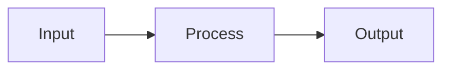

# Obsidian Linked Documentation Pattern

## Problem

When documenting projects, ideas, or brainstorms in Obsidian, notes often grow too long and become hard to navigate. A 200+ line note covering overview, architecture, implementation details, and references creates cognitive overload.

## Context / Trigger Conditions

Apply this pattern when:
- A note exceeds ~100 lines or covers 3+ distinct aspects
- Content naturally separates into "what/why" vs "how"
- Documentation will be referenced repeatedly
- Multiple people (or future-you) need to quickly understand the topic
- Content includes both summary decisions AND deep technical details

## Solution

### Structure

```
project-idea/
├── project-overview.md      # Index: scannable, links to details
├── project-architecture.md  # Detail: technical deep-dive
├── project-decisions.md     # Detail: ADRs, tradeoffs
└── project-references.md    # Detail: links, resources
```

### Index File Pattern (~50-80 lines)

```markdown
# Project Name

> One-line description of what this is

## The Problem
[2-3 sentences]

## The Solution
[2-3 sentences + simple diagram]

## Key Decisions

| Decision | Choice | Why |
|----------|--------|-----|
| Database | S3 Vectors | Cheapest, serverless |
| Framework | Next.js | Team familiarity |

→ See [[project-architecture]] for details

## Status
- [x] Research complete
- [ ] Prototype
- [ ] Production

## Related
- [[project-architecture]] - Technical details
- [[project-decisions]] - Decision records
```

### Detail File Pattern

```markdown
# Project Name: Architecture

> Part of [[project-overview]]

## TL;DR
[One paragraph summary for skimmers]

---

## [Detailed Section 1]
[Full technical content]

## [Detailed Section 2]
[Full technical content]

---

## Related
- [[project-overview]] - Main overview
- [[other-related-topic]]
```

### Frontmatter for Linking

```yaml
---
type: overview  # or: architecture, decision, reference
topic: project-name
status: draft
created: 2026-01-27
related:
  - "[[project-architecture]]"
  - "[[project-decisions]]"
parent: "[[project-overview]]"  # for detail files
---
```

### Mermaid for Diagrams

Always use Mermaid instead of ASCII art - it renders properly in Obsidian:



## Verification

After restructuring:
1. Index file is <80 lines and scannable in 30 seconds
2. Each detail file has a clear single purpose
3. All files link bidirectionally (index → detail, detail → index)
4. Someone unfamiliar can understand the project from index alone
5. Details are findable via links, not scrolling

## Example

**Before** (single 200-line file):
```
ai-zettelkasten-brainstorm.md (200+ lines)
├── Context
├── Problem
├── Solution options
├── AWS architecture comparison (50 lines)
├── Cost estimates (30 lines)
├── Schema designs (40 lines)
├── Skills design
├── Open questions
└── References
```

**After** (linked files):
```
ai-zettelkasten-plugin-brainstorm.md (60 lines)
├── Problem (3 lines)
├── Solution (5 lines)
├── Architecture Decision (table + link)
├── Core Skills (table)
├── Open Questions
└── Related: [[ai-zettelkasten-aws-architecture]]

ai-zettelkasten-aws-architecture.md (150 lines)
├── TL;DR
├── Options Comparison (table)
├── S3 Vectors details
├── Aurora details
├── Cost comparison
├── Decision matrix
└── Related: [[ai-zettelkasten-plugin-brainstorm]]
```

## Notes

- **Rule of thumb**: If you need to scroll to find something, consider splitting
- **Bidirectional links**: Always link both directions for navigation
- **Frontmatter `parent`**: Use for detail files to establish hierarchy
- **Tables for decisions**: Easier to scan than prose
- **TL;DR sections**: Every detail file should have one for skimmers
- **Mermaid > ASCII**: Always use Mermaid for diagrams in Obsidian

## See Also

- Zettelkasten methodology (atomic notes, linked thinking)
- Diátaxis documentation framework (tutorials, how-to, reference, explanation)
